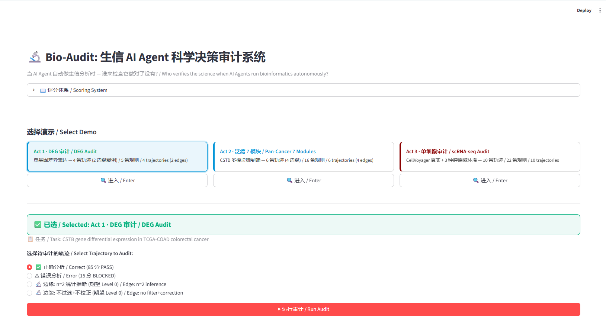
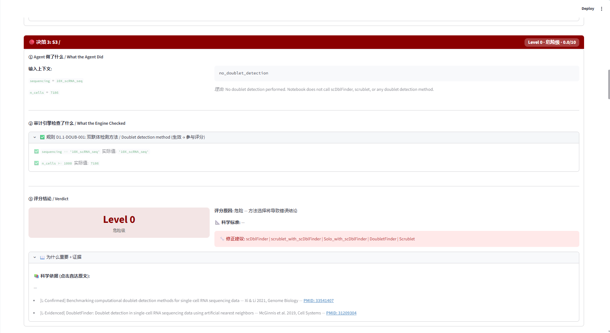
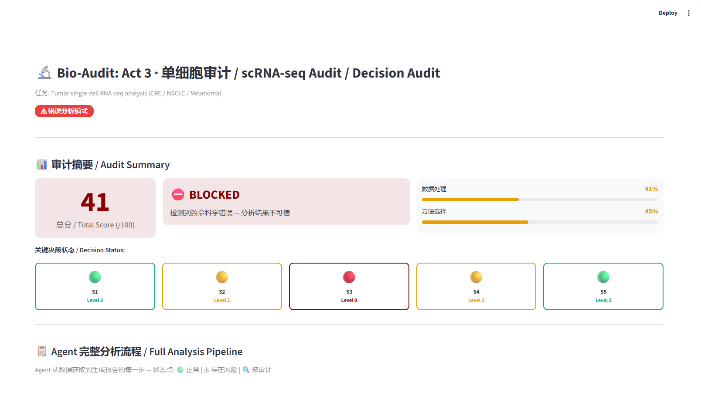
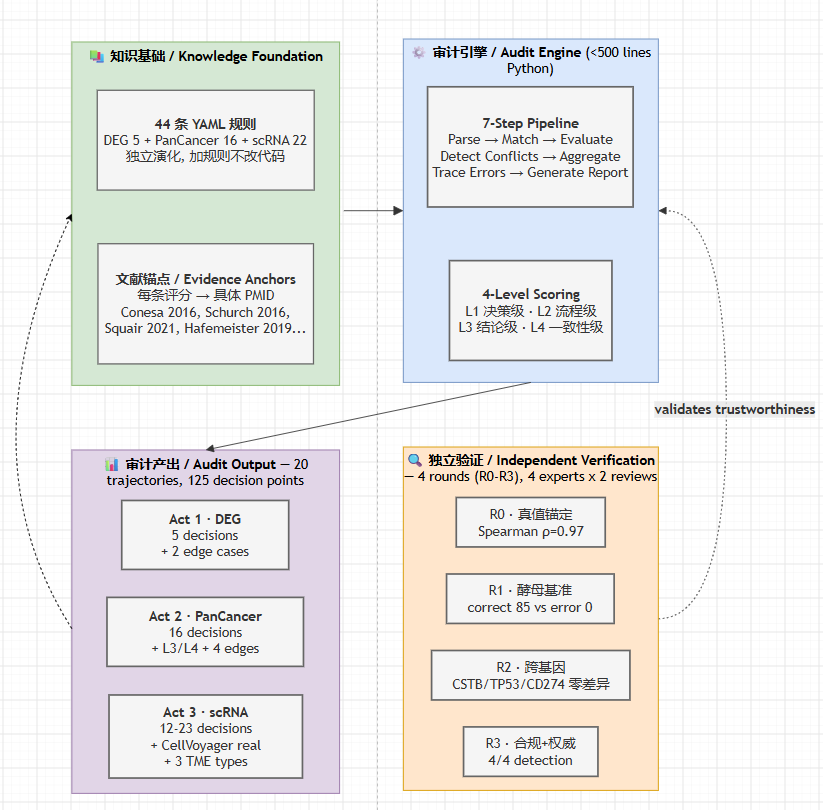
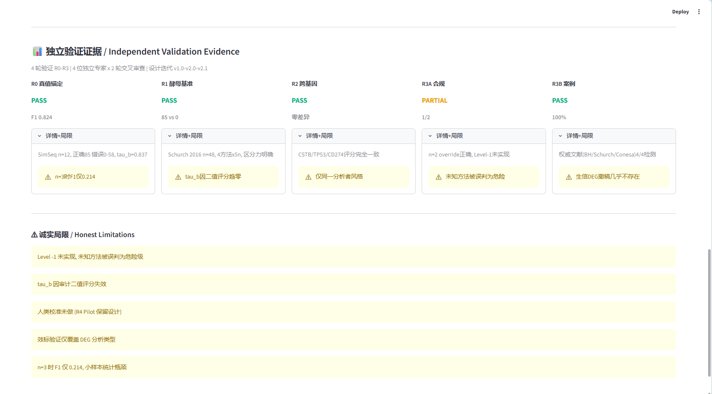

# 一套 AI 跑分析，另一套 AI 查作业——我们在生信 Agent 身上试了试

> 20 条分析轨迹、137 个决策点、43 条文献锚定规则（38 条唯一）。我们让 CellVoyager 真实跑了一次
> 单细胞分析并翻开它的决策草稿：demo 轨迹曾被抓住 5 个危险级（L0）决策；2026-08 G-2 真实运行
> 重评后为 **30.0 分（L0=0）**——两个口径严格区分，见下方"当前状态"。

---

## 当前状态（2026-08-16，v0.2.x）

五阶段重构（止血 → 地基 → 采集 lint → benchmark → reward）全部完成，真实 Agent 评测链路打通。
**引用 CellVoyager 分数时请认准口径**（教训 #2 单一事实源，禁止混写）：

| 口径 | 分数 | 决策分布 |
|---|---|---|
| demo 轨迹（2026-08-13 D5 修复后引擎重跑） | 29 分 · Blocked | **5 × L0** |
| **G-2 真实运行重评**（GSE115978 · declared 注入 + 规则平台键放宽） | **30.0 needs_correction** | **L0=0 / L1×7 / L3×1 / L-1×12** |

- 真实评测报告：[G-2 补充报告](https://tubo2333.github.io/bio-audit/docs/migration/agent-eval-report-g2.html)
  （总成本 ¥2.55、正式运行 10-12 分钟；[G 主报告留档](https://tubo2333.github.io/bio-audit/docs/migration/agent-eval-report.html)）
- 工程现状：pytest **234/234** · CI 双矩阵全绿 · golden 20 轨迹 137 决策 **0 差异** ·
  60 条任务集（IRR κ=0.8336）· ruleset 1.2.0 / engine 0.2.1
- 数字口径纪律全文：[site-design §6.2](https://tubo2333.github.io/bio-audit/docs/site-design.html)

## 快速导航

- [快速开始](https://tubo2333.github.io/bio-audit/docs/quickstart.html)（[English](https://tubo2333.github.io/bio-audit/docs/quickstart.en.html)）
- [API 契约](https://tubo2333.github.io/bio-audit/docs/api-contract.html) · [MCP 契约](https://tubo2333.github.io/bio-audit/docs/mcp-contract.html)
- [规则贡献](https://github.com/Tubo2333/bio-audit/blob/main/CONTRIBUTING.md) · [Release](https://github.com/Tubo2333/bio-audit/releases)
- [文档中心](https://tubo2333.github.io/bio-audit/docs/) · [设计文档](https://tubo2333.github.io/bio-audit/docs/specs/) · [窗口报告](https://tubo2333.github.io/bio-audit/docs/migration/)

---

如果 AI Agent 是一场考试，Bio-Audit 就是那个坐在后面翻你草稿纸的监考老师。它不说话、不帮忙——只在每一题旁边标注：这一步对了，依据是这篇论文；这一步有问题，你可能需要改成这样。这篇文章讲的是这座监考系统的来龙去脉：我们是怎么做的、怎么证明它监考得对、以及让真正的 AI Agent 考了一次试之后看到了什么。

---

去年有一段时间，我频繁地在做一个动作：用 Claude Code 帮我跑生信分析。它写代码很快，报错了会自己修，跑完了还会给你一段看起来很有道理的总结。

但你心里总有一点不太踏实——它选的方法对吗？归一化为什么用 TPM？不做多重检验校正真的没事吗？样本量只有 3 个，DESeq2 跑得动但结论真的可信吗？

这些事情，AI Agent 不会主动告诉你。它给出的代码能跑，输出看起来也对——但你不知道它的决策草稿纸上写的是什么。

---

## 让 CellVoyager 跑一次分析，然后翻开它的草稿纸（demo 轨迹复盘）



我们决定直接试一次。选的对象是 CellVoyager——Nature Methods 今年刚发的一个单细胞 AI Agent，能自主完成从 QC 到轨迹推断的全部分析。

数据用了 GSE115978，一个 Melanoma 肿瘤的 scRNA-seq 数据集，大概 7000 个细胞。把 .h5ad 文件喂进去，CellVoyager 跑完了 12 步。每一步的工具调用都成功了。输出了一份看起来没什么问题的分析报告。

然后我们拿出了 Bio-Audit。

Bio-Audit 是我们自己做的另一套东西。它的工作就是坐在 Agent 身后，看 Agent 的每一步决策草稿，然后说：这一步是对的，依据是这篇文献；这一步有问题，你可能需要改成这样。

我们让它逐步骤检查了 CellVoyager 刚才那 12 步。

**结果（demo 轨迹，2026-08-13 D5 修复后引擎重跑）：29 分，Blocked。** 五个危险级（L0）决策：

| 步骤 | 决策 | Level | 为什么是问题 |
|------|------|-------|------------|
| S3 | 没做双联体检测 | **L0** | 大约 2% 的 doublets 混在数据里，产生虚假的共表达信号 |
| S6 | 12 位患者，没做批次校正 | **L0** | 患者效应和生物学信号混在一起，分不清 |
| S7 | PCA 维度随意设为 50 | **L0** | 没跑 elbow plot，不知道这个数字从哪来的——可能过拟合噪声 |
| S10 | cell-level DEG，而不是 pseudobulk | **L0** | 把单个细胞当独立样本做差异分析——伪重复，p 值会严重膨胀 |
| S11 | 跳过轨迹推断 | **L0** | 有争议，但完全跳过等于放弃了一种维度 |



注意一下这五个错误的性质：不是"选了 t-test 而不是 DESeq2"那种答错题。是根本没做。代码没有报错，输出看起来正常，但分析的前提条件没满足。传统的代码 review 抓不到这种问题——因为它们不是 bug，是缺失。

做一下对比：同样的 12 步，如果我们用手工构造一份理想分析轨迹——SCTransform 归一化、Harmony 批次校正、pseudobulk 做 DEG、scDblFinder 做双联体检测、SingleR 加 CellTypist 交叉验证做注释——Bio-Audit 给它打 85 分。通过了。



CellVoyager 和理想轨迹差了 56 分（demo 口径）。差距不是来自一个错得离谱的模型——这个模型很聪明。差距来自它跳过了几个关键步骤。

> **关于分数口径的诚实说明**：上表 29 分 5 L0 是 **demo 轨迹**（20 条 legacy 轨迹之一）在
> 2026-08-13 D5 修复（移除"条件可接受"无条件加分 bug）后的引擎重跑结果；修复前旧口径为 48.3 分，
> 其中一部分来自 bug 的虚增，一部分来自旧规则词表（如 `PCA_arbitrary` 未被规则收录导致 L0 判定）。
> **2026-08-16 G-2 真实运行重评**（CellVoyager 在 GSE115978 上真实运行，declared 注入 + 规则平台键
> 放宽后，零成本重评）得 **30.0 分（L0=0 / L1×7 / L3×1 / L-1×12）**——两者对象不同、口径不同，
> 禁止混写。全程留痕见 [G-2 报告](https://tubo2333.github.io/bio-audit/docs/migration/agent-eval-report-g2.html)。

---

## 这不是 CellVoyager 的问题

如果只有 CellVoyager 这样，这只是一个"某个 Agent 不够好"的故事。但 2025 到 2026 年之间，至少有 8 个独立基准测试报告了同一个发现：

**BiomniBench 的 100 个真实研究任务**里，所有前沿模型挤在 60 到 64 分之间，最好的是 Claude Code 加 Opus 4.7：73.34 分。**没有人及格。** 最让人不安的细节不是分数低——是 Agent 在"方法选择、生物学解释和科学推理"这三个维度上系统性得分最低。

**GeneBench 的 103 个基因组学推理评估**中，GPT-5.5 的通过率是 25%。60% 的问题下，即使是最强的配置也只有不到 20% 的通过率。模型能识别出局部的诊断信号（"这里有一个异常值"），但推不出正确的分析决策（"所以你需要用稳健回归而不是普通最小二乘"）。

**EpiBench 的报告里有一句话特别扎眼**：68.2% 的单个计分字段通过了，但最终生物答案的通过率只有 31%。Agent 算出了正确数字，然后换成了它熟悉的那个错误默认值。

**FlowBench 贡献了一个更让人后怕的发现**：最危险的故障模式叫"不安全修复"——Agent 把错误码清除了，但底层数据已经烂了，下游步骤继续跑在损坏的输入上。推理级别的模型在这个能力上反而不如便宜模型。

八份报告，同一个结论：**Agent 的执行能力超过了它的判断能力。** 工具调用成功率 98% 以上，科学正确性 56% 到 76%。差距不在"会不会用工具"，在"知不知道什么时候不该用"。

---

## 知道有问题 ≠ 能修这个问题

这些基准做了一个非常非常重要的工作——诊断。它们告诉你 gap 的大小、位置和方向。但它们不是用来填 gap 的。

BiomniBench 的输出是"你的 Agent 得了 64 分"——但不会告诉你第三项的归一化方法选错了。Google 的 CoE Audit 能发现论文引用是否造假——但不会审你的 DESeq2 是用 raw counts 还是 TPM 数据跑的。nf-core 的 nf-test 能保证代码没崩——但 t-test 在 nf-test 下完美通过，在审计下得零分。

| | 审计对象 | 审计粒度 | 证据锚点 | 可嵌入 | 自成验证 |
|---|---------|---------|---------|--------|--------|
| BiomniBench | Agent 轨迹 | 6 维度 A/B/C | 专家 rubric | ❌ | ❌ |
| GeneBench | Agent 终答 | 端点评分 | 可验证答案 | ❌ | ❌ |
| CoE Audit | AI 论文 | 逐声明 | 原文引用 | ❌ | ✅ |
| nf-test | Pipeline | 代码级 | Snapshot | ✅ | ❌ |
| MedSkillAudit | 临床 Agent | 双层否决 | 指南 | ✅ | ❌ |
| **Bio-Audit** | **分析决策** | **决策级逐步骤（L1-L2 落地；L3/L4 设计中）** | **PMID** | **✅** | **✅ R0-R3** |

我们想要的东西是：**Agent 跑完分析之后，能逐步骤告诉你哪一步有问题、为什么是错的、依据哪篇文献、建议怎么修。**

Bio-Audit 就是按这个想法做的。

> 关于 L3/L4 的诚实说明：设计中的四层审计（L1 决策级 / L2 流程级 / L3 结论级 / L4 一致性级）目前引擎落地了
> L1-L2 决策级与流程级审计；L3/L4 在早期子项目中有原型（CSTB 场景硬编码版），已列入重构排期重写为通用实现
> （设计依据在仓库外审计内存 docs/specs/refactor-plan-v1.1.md，不进本站）。

---

## 把 43 篇论文的结论变成一组自动化规则

核心设计极其简单。



引擎是三个 Python 函数——匹配、评估、聚合——加起来不到 500 行。

规则是 43 个 YAML 文件（去重后 38 条唯一规则），一个文件就是一条决策规则。每一条规则写清楚：在什么条件下，Agent 选了什么方法应该得几分。Level 3 是正确的，Level 0 是危险的。每条规则的评分依据不是"我觉得"，而是具体的文献出处：Conesa 2016 (PMID: 26813401)、Schurch 2016 (PMID: 27022035)、Love 2014 (PMID: 25516281)。不是笼统的"参考文献建议"，是**这一个决策的评分直接引用这一篇论文的这一段结论**，链接可点击直达 PubMed。

为什么用 YAML 文件而不是数据库？因为加一条规则只需要新建一个文件，不需要改引擎代码。你读到一篇新的基准论文，发现了一种新的常见错误——花 20 分钟写一个 50 行的 YAML，规则库就更新了。

这套引擎目前管着三层规模的分析：

* **DEG**：5 个决策点，5 条规则。最基础的单基因差异表达。
* **泛癌 7 模块**：16 个决策点，16 条规则。从表达到生存到免疫到药物到跨模块一致性。
* **单细胞**：20 个决策类型，22 条规则。包括了 CellVoyager 的真实输出和 3 种不同肿瘤微环境（CRC 免疫浸润型、NSCLC 免疫沙漠型、Melanoma 免疫热型）的正确轨迹。

2026-08 重构后（v2）：四个分裂项目合并为单一仓库，决策类型本体化（34 个类型 × context schema × missing 三档语义），规则治理三闸门禁（清单校验 / 冲突检测 / golden 回归）接入 CI，任何规则改动都有分数漂移报告兜底——加规则从"改一个文件"升级为"走一条受控流水线"。

---

## "审 Agent 之前，我们先审了自己"

这句话是我们写设计文档时定的原则。

在写第一行 Demo 代码之前，Bio-Audit 的评分系统自己先被审了 4 轮。

* **R0 · 真值锚定**：用模拟 RNA-seq 数据生成了一组已知 ground truth 的 dataset——1000 个基因，其中 100 个是 DEG。构造了 5 种不同的方法组合，从"全对"到"全错"。跑完审计后，审计分数和实际 F1 之间的 Spearman 相关系数是 0.9747，Kendall τ_b 是 0.9487（2026-08-13 D5 修复后重算，排序一致性保持不变）。换句话说，我们的评分系统给高分的方法组合，实际表现确实更好。
* **R1 · 酵母基准**：Schurch 等人 2016 年在 RNA 期刊上发了一个经典实验——48 vs 48 的酵母 RNA-seq，因为重复数巨大，全数据的 DEG 列表可以作为 ground truth (PMID: 27022035)。我们下载了真实数据，在不同的子样本量下（n=3 到 n=48）跑了 4 种方法 × 5 个 n 档 = 20 个组合。结果：DESeq2、edgeR、limma-voom 在所有条件下审计都是 85 分——因为这个审计系统审的是**方法选择是否正确**，不是**n 够不够大**。ttest 在所有条件下都是 0 分。
* **R3B · 权威文献案例**：四个基于领域共识的典型错误——不做多重检验校正（Benjamini-Hochberg 1995）、n=2 跑 DESeq2（Schurch 2016）、不做低表达基因过滤（Conesa 2016）、对 raw counts 用 t-test（Love 2014）。全部被正确评分为 Level 0 或 Level 1。4/4，100%。
* **R2 · 跨基因一致性**：拿三个不同基因（CSTB/TP53/CD274）的 DEG 分析轨迹去审，同一个决策类型的评分完全一致——规则不硬编码基因名。



验证方案本身也不是我们觉得没问题就过的。我们找了四个不同角度的独立专家——生信方法学、统计实验设计、AI 评测框架、以及一个"如果你是期刊审稿人你会说什么"的外部研究员——做了两轮交叉审查。第一轮暴露了 20 个致命缺陷，全部修正。第二轮聚焦检查修正是否真正解决了问题。最终定稿的验证方案版本号是 v2.1。

这条验证链的每一个版本和每一个专家报告都可以在我们的文档里追溯到。

---

## 跑完 137 个决策点之后，三个让我们意外的发现

整个 deepening 阶段最终产出了 20 条轨迹、137 个独立决策点。审计引擎对每一条都跑了一遍。这三个发现最让我们意外。

**第一个：Agent 的盲区是"跳过"，不是"选错"。**

这不是语义差别——这对怎么设计审查工具有直接影响。选错是"做了但做错了"，可以通过阅读代码的 method 部分发现。跳过是"没做"，需要对照一个隐式的"你应该做这些"清单才能识别——而 Agent 自己不会给你一个"我跳过了什么"的清单。Bio-Audit 的价值可能就在这张清单上。

**第二个：PanCancer 是真正的雷区，绝对 L0 数量最多。**

Act 1（DEG，5 个决策类型）和 Act 3（scRNA，20 个决策类型）的错误率其实还好。但 Act 2 的生存分析和跨模块一致性区域贡献了最多的绝对 L0 数。最危险的两种决策类型——`independent_prognostic_claim` 和 `events_per_variable`——错误率都是 67%。如果你的 Agent 声称一个基因是"泛癌独立预后标志物"，大概率它没做多变量校正、没检验 PH 假设、没算肿瘤纯度。这些不是小瑕疵，是从单变量直接跳结论的逻辑断层。

**第三个：分数会压缩，但排序不会。**

以 demo 轨迹样本为例：一个 12 步的单细胞分析中，5 步是 L0，其余步有对有错。按直觉，5/12 出错应该接近 0 分——但实际得分在 30 到 50 分区间（修复后口径），因为正确的步骤拉高了整体分数。这看起来像"审计太松"，但实际上是一个合理的设计决策：你不想因为 Agent 在某一步的疏忽就把整个分析判死刑——特别是在那一步的后果可能没那么严重的情况下。真正重要的是两件事：**L0/L1 的计数**（几个危险决策）和**排序**（这套分析和那套分析哪个更可靠）。Spearman 的 0.9747 告诉我们排序是稳的。

---

## 诚实地说

Level -1（无法评估）在 v2 重构中已经落地：系统能区分"不认识的新方法"（返回 -1，不再误判为 L0）和"危险的方法"（L0）——missing 三档语义 + unclassified 标记。G-2 真实运行重评中的 12 条 L-1 正是"无法评估"占位（immune_correlation_method 为 scRNA 范式规则覆盖缺口，非采集缺口，见 [G-2 报告](https://tubo2333.github.io/bio-audit/docs/migration/agent-eval-report-g2.html)）。

人类校准还没做。设计文档里留了 R4 的位置，但 2 到 3 个评分者的 Krippendorff's α 在 20 条轨迹上的置信区间太宽（从 0.42 到 0.89），为了一个不太可信的数字去麻烦三个同学不值得。先留白。

单细胞的锚定验证因为 Bioconductor 被 GFW 阻断，没法用 splatter 包，改用 numpy 模拟数据替代。不完美，但记录在案。

43 条规则远远不够。加规则要花钱——不是代码的钱，是读文献的钱。我们为此写了一份规则提取 SOP：系统检索 → 质量评级 → 提取结论 → 编码 YAML → 独立校验。流程有了，接下来是填充。

我们的工作借鉴了 BiomniBench 的 6 维度评分架构、CoE Audit 的证据链理念、FlowBench 的"执行-判断分离"发现。它不是"更好的基准"——它是在基准告诉你"只有 64 分"之后，你想知道**具体哪一步出了问题、应该怎么修**时用的东西。

---

## 怎么跑

推荐 v2 单仓库（见[快速开始](https://tubo2333.github.io/bio-audit/docs/quickstart.html)）：

```bash
pip install -e ".[dev,ui]"     # Python >= 3.10
bio-audit run <轨迹.json>      # 命令行审计一条轨迹
bio-audit golden               # golden 回归（20 轨迹 137 决策，0 差异）
bio-audit ruleset-validate     # 规则治理三闸（清单/冲突/golden）
```

旧版全流程演示（Docker，含 R0-R3 验证数据，镜像为 2026-08 前旧版引擎，分数为旧口径）：

```bash
docker run -p 8504:8504 ghcr.io/tubo2333/bio-audit-fullflow:latest
```

开源（Apache-2.0）。欢迎来审——我是说，欢迎来审我们的审计。
